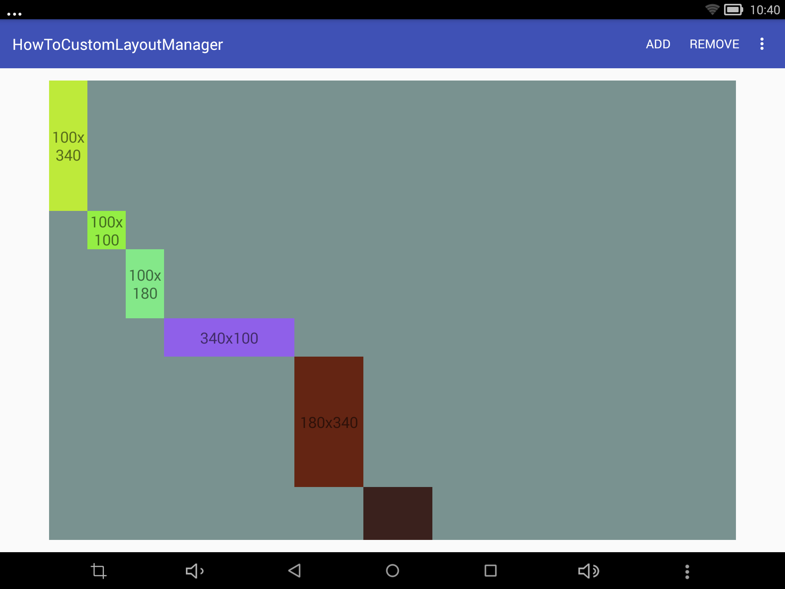
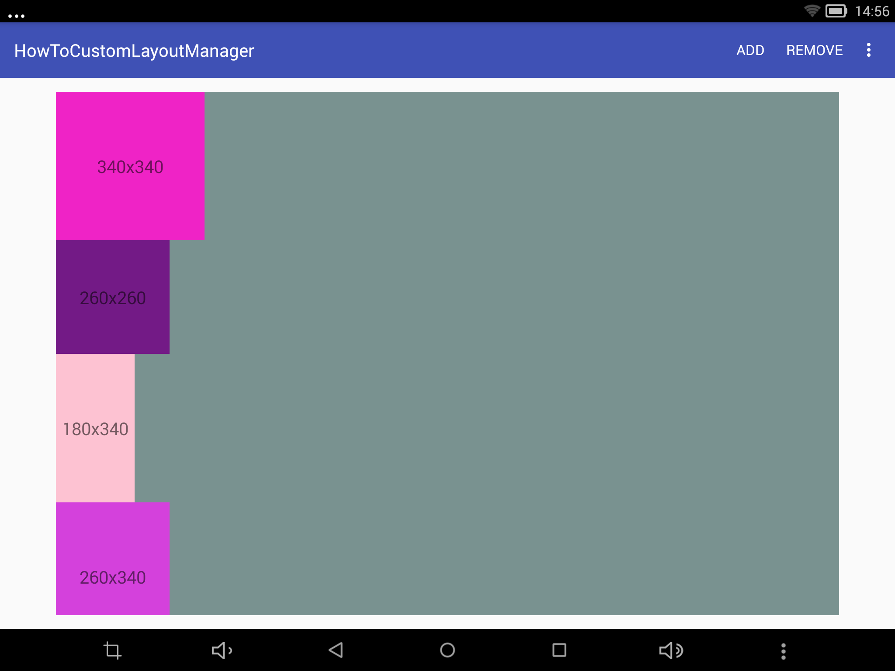

# HowToCustomLayoutManager
展示自定义RecyclerView的LayoutManager的过程，可以按顺序检出tag来查看每个阶段的代码

### 1.0.2
展示一个实现了重用和横纵向滑动的斜线布局的CustomLayoutManager

### 1.0.1
展示一个简单斜线布局的CustomLayoutManager，没有实现重用和滑动

### 1.0.0
展示一个使用[LinearLayoutManager](http://developer.android.com/reference/android/support/v7/widget/LinearLayoutManager.html)布局的示例

## License
[Apache License Version 2.0](http://www.apache.org/licenses/LICENSE-2.0.txt)

